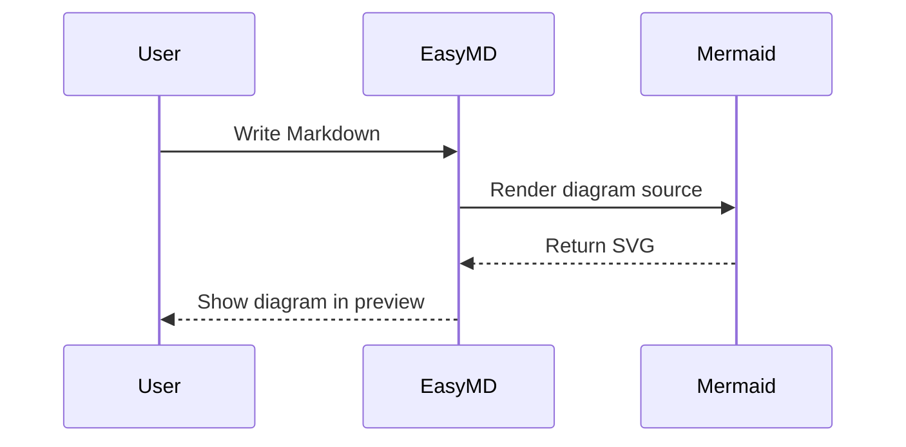

# EasyMD

EasyMD is a lightweight cross-platform desktop Markdown editor inspired by Typora.

## Features

- Markdown source, preview, and split editing modes
- Live preview with scroll sync
- LaTeX rendering with KaTeX
- Mermaid diagram rendering
- Syntax highlighted code blocks
- Code fence language completion
- File and outline sidebar
- Typora-style context menu
- Local file open/save support
- PDF export
- Theme presets
- Custom themes from the local `themes/` folder
- Customizable keyboard shortcuts
- Built-in English and Simplified Chinese UI
- In-app notifications and unsaved-change confirmation
- Draggable split-view divider

## Run Locally

For normal local use on Windows, double-click:

```text
EasyMD.bat
```

For development:

```bash
npm install
npm run dev
```

For a production build:

```bash
npm run build
npm start
```

## Custom Themes

EasyMD automatically reads custom CSS themes from the project root `themes/` folder.

1. Copy `example_theme/easymd-theme-template.css` into `themes/`.
2. Rename the copied file, for example `ocean-note.css`.
3. Edit the CSS variables and styles.
4. Restart EasyMD, or click the refresh button beside the theme selector.
5. Select the theme from the dropdown.

You can set the display name with a comment marker:

```css
/* @theme-name Ocean Note */
```

EasyMD validates theme CSS before applying it. If the current theme becomes invalid, EasyMD falls back to `Night`.

See the full guide: `docs/custom-themes.md`.

## Shortcuts

EasyMD ships with common defaults such as `Ctrl+S` for save, `Ctrl+O` for open, `Ctrl+B` for bold, and `Ctrl + mouse wheel` for editor zoom.

Open Settings from the toolbar, or press `Ctrl+,`, to customize shortcuts when they conflict with system or app-level shortcuts on your computer.

## Language

EasyMD supports Simplified Chinese and English in the interface. Open Settings and use the language selector to switch the UI language.

When adding new user-facing text, keep the text in the `zh` and `en` dictionaries in `src/App.tsx` so the app does not mix languages.

## Markdown Support

EasyMD supports common Markdown features, including headings, lists, task lists, blockquotes, links, code blocks, LaTeX, and Mermaid diagrams.

Mermaid example:

````markdown

````

PDF export is available from the toolbar or the File menu. EasyMD shows an in-app notification when the export succeeds, is cancelled, or fails.

## Package

Windows packaging is configured with electron-builder:

```bash
npm run dist:win
```

This creates `release/win_x86_64_installer.exe`.

Linux packaging is configured for deb and AppImage:

```bash
npm run dist:linux
```

This creates `release/easymd.deb` and `release/easymd.AppImage`.

## Publish A GitHub Release

Release builds are automated with GitHub Actions. Push a version tag and GitHub will build the Windows installer and Linux packages, then create a draft release with downloadable assets.

```bash
git tag v0.1.0
git push origin v0.1.0
```

After the workflow finishes, open the draft release on GitHub, review the notes, and publish it.

Release assets:

- `win_x86_64_installer.exe` for Windows x86_64 users
- `easymd.deb` for Debian/Ubuntu users
- `easymd.AppImage` for general Linux users

## Project Layout

```text
electron/        Electron main and preload processes
src/             React renderer application
assets/          Project assets such as icons
public/          Static web assets
example_theme/   Custom theme template
themes/          User-managed custom themes
dist/            Built renderer output
dist-electron/   Built Electron process output
```

## License

MIT
